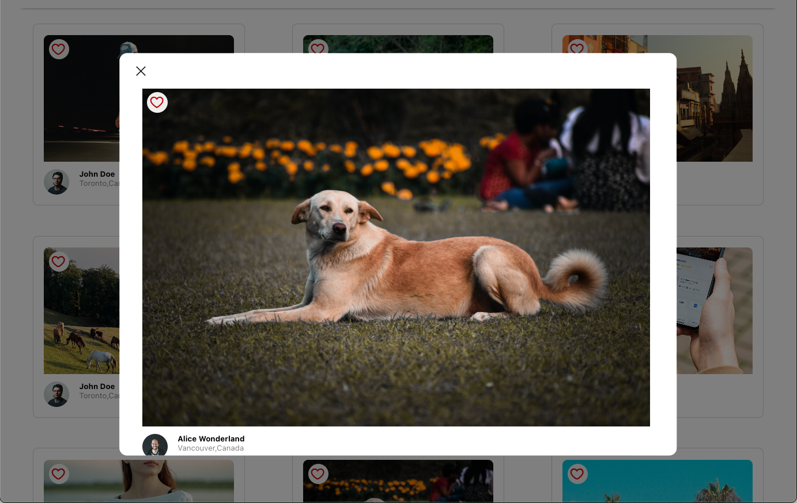

# Photolabs 📷
React-based single-page client side application that allows users to view photos in different contexts.

## Tech Stack
<a href="https://skillicons.dev">
  
</a>


## User Stories 👤
* A user can view photos from the homepage loaded from the API.
* The user can navigate to different photo categories, also called topics.
* The user can click on a photo to view a larger version of the photo and relevant / similar photos.
* The user can like a photo from anywhere within the application where the photo is displayed.
* The user can view a heart icon with a notification in the navigation if there are liked photos.
* The navigation will consist of different topics and heart icon.
* The client-side application will make API requests to load and persist data (i.e. relevant data is not lost after loading a topic).

## Setup ✅

Install dependencies with `npm install` in each respective `/frontend` and `/backend`.

### [Frontend] Running Webpack Development Server

```sh
cd frontend
npm start
```

### [Backend] Running Backend Servier

Read `backend/readme` for further setup details.

```sh
cd backend
npm start
```

## Dependencies
* React
* Create React App
* Webpack

## devDependencies
* Babel
* Express
